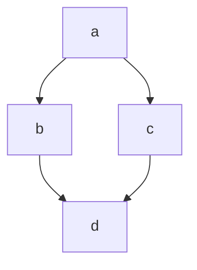

# markdown

# titulo 1

## titulo 4

### titulo 4

#### titulo 5

###### titulo 6

Paragrafo

se voce der espaço
entre linha, entao voce
tera um novo paragrafo.

Quebra de linha  
com dois espços

ao final da linha.<br> é o mesmo \<br> que voce encontra no html

**negrito**
**negrito**
_sublinhado_
~~riscado~~
_italico_

==Em== um **paragrafo** podemos usar todos os anteriores

## ==lista==

1. ordenadas
2. quando voce usa um numero, o
3. proximo item sera automatico incremental
   1. subitem
   2. subitem
   3. subitem
      1. subitem
   4. subitem
   5. subitem
      1. subitem
   6. subitem
   7. subitem
4. subitem
5. subitem
6. subitem

- Nao ordenadas
- Nao ordenadas
- Nao ordenadas

* voce pode usar um asterisco ou um hifen

- sinal de +
  - Nao ordenadas
  - Nao ordenadas
  - Nao ordenadas
  - Nao ordenadas
  - Nao ordenadas
  - Nao ordenadas
  - Nao ordenadas

* O correto é não misturar os sinais

## Links

[Click Aqui!!](https://google.com/)

[ancora](#markdown)

Aqui é um paragrafo com link [Clique aqui](https://google.com/ "titulo")

https://google.com/

## imagens

/i.s3.glbimg.com/v1/AUTH_08fbf48bc0524877943fe86e43087e7a/internal_photos/bs/2023/q/l/TIdfl2SA6J16XZAy56Mw/canvaai.png>)

/i.s3.glbimg.com/v1/AUTH_08fbf48bc0524877943fe86e43087e7a/internal_photos/bs/2023/q/l/TIdfl2SA6J16XZAy56Mw/canvaaig>)

## imagem com link

[/i.s3.glbimg.com/v1/AUTH_08fbf48bc0524877943fe86e43087e7a/internal_photos/bs/2023/q/l/TIdfl2SA6J16XZAy56Mw/canvaai.png>)](<https://s2-techtudo.glbimg.com/L9wb1xt7tjjL-Ocvos-Ju0tVmfc=/0x0:1200x800/984x0/smart/filters:strip_icc()/i.s3.glbimg.com/v1/AUTH_08fbf48bc0524877943fe86e43087e7a/internal_photos/bs/2023/q/l/TIdfl2SA6J16XZAy56Mw/canvaaig>)

## citacao

> jessica é uma programadora
> Fé
> No
> Pai
> Amem

> bfhebsfdsfhsd
> fsdfsdfsfd
> sdfsdfsdf

> <br>
> jessica
> <br><br>

> jessica 1
>
> > jessica 2
>
> ### ==jessica== correndo

<details>
<summaty>
Clica aqui
</summaty>
jessica não veio ontem, sabe la Deus pq
</details>

## separador

pode ser 3 traços

---

ou pode ser 3 asteriscos

---

## checklist

- [ ] Item 1
- [ ] Item 2
- [ ] Item 3
- [ ] Item 4
- [ ] Item 5
- [ ] Item 6

## tabela

| nome   | idade |
| ------ | :---: |
| julia  |  20   |
| carlos |  35   |

| nome   | idade |
| ------ | ----: |
| Júlia  |    20 |
| Carlos |    35 |

## CÓDIGO

Em linha usamos 1 acento grave para abrir
o código em outro para fechar

`<h1> Eu sou um titulo</h1>`

<h1> Eu sou um titulo</h1>

`# Eu sou um titulo`

# Eu sou um titulo

`console.log('Olá mundo!')`

### bloco de código

Usaremos 3 acentos graves para abrir,
sguindo da liguagem que eu quero, e para fechar mais 3 acentos graves.

```html
<details>
  <summaty> Clica aqui </summaty>
  jessica não veio ontem, sabe la Deus pq
</details>
```

```CSS

.contrainer{
   display:flex;
}
```

```javascript

console.log('Olá, mundo');

funtion dados (dados){
   console.log(dados);
}

```

## emojis

:s
:rocket:
:smirk:
:elephant:
:D



<!-- comentario -->
